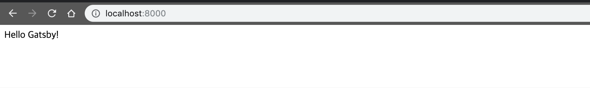

습득한 지식을 글로 남겨야겠다는 생각을 계속해왔지만 실행에 옮기지 못했다. 예전부터 한 번쯤은 해보고 싶었던 정적 사이트 생성기로 웹사이트를 만든 기록을 시작으로 글을 조금씩 써보려 한다.

## Gatsby를 선택한 이유

2015년 도메인을 처음 샀을 때만 해도 Ruby나 Python 생태계를 좀 더 이해하고자 [Jekyll](https://jekyllrb.com)이나, [Lektor](https://www.getlektor.com)로 개인 웹사이트를 만들 생각이었다. 하지만 어느덧 2019년이 됐고 요즘 트렌드는 [Gatsby](https://www.gatsbyjs.org)가 대세로 보인다. 대세에 합류하면서 다음과 같은 목적을 이루기 위해 Gatsby를 선택했다.

* 기존에 생성해둔 HTML 페이지를 그대로 운영해야 한다.
* 모어던 JavaScript 생태계를 경험해보자.
  - [TypeScript](https://www.typescriptlang.org) 쓸만한가?
  - [CSS in JS](http://michelebertoli.github.io/css-in-js/) 써도 괜찮을까?
  - [GraphQL](https://graphql.org) 어떻게 쓰는 걸까?

## 프로젝트 생성

Gatsby의 구성 요소를 조금 더 이해하기 위해 최소한의 설정으로 시작해보았다. gatsby-cli를 사용해서 프로젝트를 생성할 경우 [gatsby-starter-hello-world](https://github.com/gatsbyjs/gatsby-starter-hello-world)를 쓰면 된다. 이 글에서는 스타터 프로젝트를 사용하지 않고 npm을 사용해 프로젝트를 구성한다.

먼저 기존에 갖고 있던 정적 HTML 파일은 [`static` 디렉토리](https://www.gatsbyjs.org/docs/static-folder/) 하위로 옮기자. Gatsby는 빌드 시 `static` 디렉토리 아래의 파일들을 자동으로 루트 에셋으로 포함시킨다.

```bash
mkdir static && mv * static/*
```

npm으로 Node.js 프로젝트를 생성하고, 최소한의 의존관계를 추가한다. 이 사이트는 [GitHub Pages](https://pages.github.com)를 사용해서 운영해왔기 때문에 배포 툴로 `gh-pages`를 사용했다. 

```bash
npm init -y
npm i -E gatsby react react-dom
npm i -E -D gh-pages
```

`package.json` 파일의 script 설정에 개발과 배포를 위한 스크립트를 등록한다.

```js:title=package.json
  ...
  "scripts": {
    {/* highlight-start */}
    "develop": "gatsby develop",
    "start": "npm run develop",
    "deploy": "gatsby build && gh-pages -d public -b master"
    {/* highlight-end */}
  },
  ...
```

빈 [Gatsby 설정 파일](https://www.gatsbyjs.org/docs/gatsby-config/)을 추가한다. 해당 파일은 빌드 시 Gatsby가 자동으로 인식하는 파일이며, 사이트의 메타 데이터나 플러그인을 설정한다.

```js:title=gatsby-config.js
module.exports = {
}
```

Gatsby는 `src/pages` 디펙토리 하위의 React 컴포넌트들을 자동으로 페이지로 등록한다. 시작 페이지를 만들어보자.

```jsx:title=src/pages/index.js
import React from 'react'

export default () => (
  <div>
    Hello Gatsby!
  </div>
)
```

이제 개발 준비가 완료됐다. `npm start` 명령어로 개발 서버를 시작시키고 http://localhost:8000 주소로 접속해보자. src/pages/index.js 파일을 편집하면 실시간으로 변경사항을 확인할 수 있다.



기초적인 설정이 완료된 후 생성된 파일들은 다음과 같다.

```bash
├─ src               # 앞으로 모든 코드는 src 하위에 생성됨
│  └─ pages          # 해당 디렉토리 아래 생성되는 컴포넌트는 페이지로 자동 등록
│     └─ index.js    # 첫 페이지
├─ static            # 기존에 갖고 있던 HTML 파일, 이미지, favicon, CNAME 설정 등
├─ gatsby-config.js  # Gatsby 설정 파일
└─ package.json      # Node.js 프로젝트 메타데이터, 의존관계 등 기술

```

다음 글에서는 웹페이지의 Layout 컴포넌트를 만들어 보겠다.

## Reference
* [Gatsby Tutorial - Set Up Your Development Environment](https://www.gatsbyjs.org/tutorial/part-zero/)
* [Gatsby Tutorial - Get to know Gatsby building blocks](https://www.gatsbyjs.org/tutorial/part-one/)
* [Gatsby Docs - Using the Static folder](https://www.gatsbyjs.org/docs/static-folder/)
