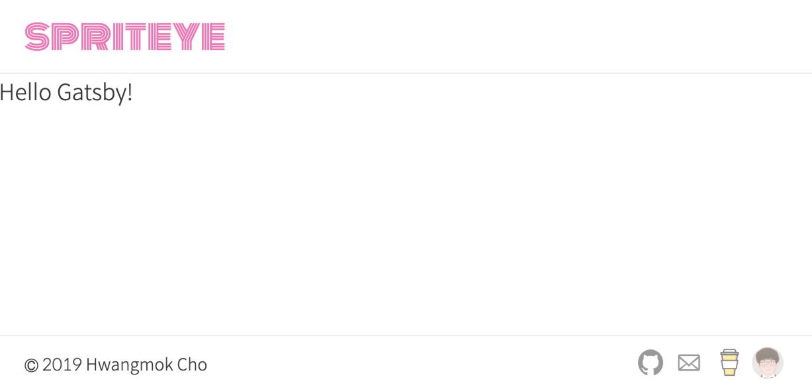

[지난 글](/posts/2019/09/gatsby-getting-started)에서 프로젝트를 초기화해두었다. 각 페이지마다 변하지 않는 헤더와 푸터같은 컴포넌트가 반복적으로 나타나게 마련이다. 이번 글에서는 페이지마다 반복되는 코드 작성을 피하기 위해 Layout을 컴포넌트로 분리한다.

## [styled-components](https://www.styled-components.com)

styled-components의 공동 개발자 중 한 명인 [Max Stoiber](https://twitter.com/mxstbr)는 styled-components의 기본 아이디어는 스타일과 컴포넌트 간의 연결을 제거함으로써 모범 사례를 강제하는 것[^1]이라고 했다. 스타일을 컴포넌트에 캡슐화하고 이를 재사용하는 것이 이 모듈의 핵심이다. 편리하며, 직관적이다. 더 이상 CSS 이름 짓기, 방법론에 대해서 고민할 필요가 없다. 인기도 있다.[^2] 이와 같은 이유로 개인 웹사이트 만들 때 사용할 CSS 모듈로 styled-components를 선택했다.

## 스타일 초기화

브라우저 별로 조금씩 다른 기본 스타일을 갖는다. [`normalize.css`](https://necolas.github.io/normalize.css/)를 사용하면 브라우저 별 HTML 스타일의 일관성을 유지하도록 도와준다. [`polished`](https://github.com/styled-components/polished)를 사용하면 styled-components의 [글로벌 스타일 정의](https://www.styled-components.com/docs/api#createglobalstyle)에 normalize.css를 쓸 수 있다.

필요한 패키지를 설치해주자.

```bash
npm i -E \
  babel-plugin-styled-components \
  gatsby-plugin-alias-imports \
  gatsby-plugin-styled-components \
  polished \
  react-icons \
  styled-components
```

Gatsby 설정에 [`gatsby-plugin-alias-imports`](https://www.gatsbyjs.org/packages/gatsby-plugin-alias-imports/)와 [`gatsby-plugin-styled-components`](https://www.gatsbyjs.org/packages/gatsby-plugin-styled-components/)를 추가한다. `gatsby-plugin-alias-imports` 플러그인은 src 하위의 컴포넌트를 import 할 때 상대 경로를 쓰지 않기 위해 사용한다.

```js:title=gatsby-config.js
module.exports = {
  {/* highlight-start */}
  plugins: [
    {
      resolve: 'gatsby-plugin-alias-imports',
      options: {
        alias: {
          '~components': 'src/components',
          '~styles': 'src/styles'
        },
        extensions: []
      }
    },
    'gatsby-plugin-styled-components'
  ]
  {/* highlight-end */}
}
```

글로벌 스타일을 정의한다. 메인 폰트는 [스포카 한 산스](https://spoqa.github.io/spoqa-han-sans/ko-KR/)를 사용했으며, 타이틀의 적당한 스타일을 지정하기 위해 구글 폰트에서 [Monoton](https://fonts.google.com/specimen/Monoton)을 골라봤다.

```js:title=src/styles/GlobalStyle.js
import { normalize } from 'polished'
import { createGlobalStyle } from 'styled-components'

const GlobalStyle = createGlobalStyle`
  @import url(//spoqa.github.io/spoqa-han-sans/css/SpoqaHanSans-kr.css);
  @import url(//fonts.googleapis.com/css?family=Monoton|Nanum+Gothic&display=swap);

  ${normalize()}

  body {
    color: #333;
    font-weight: 300;
    font-size: 17px;
    font-family: 'Spoqa Han Sans', 'Nanum Gothic', sans-serif;
    line-height: 1.5;
    word-break: keep-all;

    background-color: white;
  }

  a {
    color: #333;
    text-decoration: none;
  }
`

export default GlobalStyle
```

## 고정 영역 Header, Footer

기본적으로 페이지마다 스크롤되어도 사라지지 않는 Header, Footer를 갖는 레이아웃을 구성한다.

Header, Footer 컴포넌트의 내용은 `50rem` 넓이를 가지며 화면에서 중앙 정렬시켜야 한다. 또한 전체 넓이에서 `border-bottom`, `border-top`를 설정해야 한다. 때문에 Header, Footer 컴포넌트는 전체 넓이를 사용하고 내부 컨테이너의 넓이를 `50rem`으로 사용했다. Header, Footer에 쓸 컨테이너 이름은 뭐로 할까 고민하다 `MarginalContaner`라 명명했다. 참고로 컴포넌트의 네이밍은 [Structuring projects and naming components in React](https://hackernoon.com/structuring-projects-and-naming-components-in-react-1261b6e18d76)의 Naming components 단락을 참고했다.

```js:title=src/components/Layout/MarginalContainer.js
import styled from 'styled-components'

export default styled.div`
  display: flex;
  align-items: center;
  justify-content: space-between;
  width: 50rem;
  margin: auto;
  padding: 0 1.2rem;
`
```

Header 컴포넌트에는 우선 타이틀만 지정한다.

```js:title=src/components/Layout/Header.js
import { Link } from 'gatsby'
import React from 'react'
import styled from 'styled-components'

import LayoutMarginalContainer from '~components/Layout/MarginalContainer'

const StyledHeader = styled.header`
  position: sticky;
  top: 0;
  z-index: 1000;

  display: flex;
  height: 3.5rem;

  background-color: white;
  border-bottom: 1px solid #eee;
`

const StyledTitle = styled(Link)`
  display: flex;

  color: hotpink;

  font-size: 1.8rem;
  font-family: Monoton, sans-serif;
`

const Header = () => (
  <StyledHeader>
    <LayoutMarginalContainer>
      <StyledTitle to='/'>spriteye</StyledTitle>
    </LayoutMarginalContainer>
  </StyledHeader>
)

export default Header
```

Footer 컴포넌트에는 Copyright, 연락처, 내 소개 등의 링크를 추가한다.

```js:title=src/components/Layout/Footer.js
import { Link } from 'gatsby'
import React from 'react'
import styled from 'styled-components'
import { GoMail, GoMarkGithub } from 'react-icons/go'

import Avatar from '~components/Avatar'
import LayoutMarginalContainer from '~components/Layout/MarginalContainer'

const StyledFooter = styled.footer`
  position: fixed;
  bottom: 0;

  display: flex;
  width: 100vw;
  height: 2.5rem;

  font-size: 0.75em;

  background-color: white;
  border-top: 1px solid #eee;
`

const StyledContactList = styled.div`
  display: flex;
  align-items: center;
`

const StyledContact = styled.a`
  display: inline-flex;
  justify-content: center;
  width: 1.85rem;

  font-size: 1.2rem;

  opacity: .5;

  &:hover {
    opacity: 1;
  }
`

const StyledMe = styled(Link)`
  display: inline-flex;
  justify-content: center;
  width: 1.85rem;

  opacity: .5;

  &:hover {
    opacity: 1;
  }
`

const Footer = () => (
  <StyledFooter>
    <LayoutMarginalContainer>
      © 2019 Hwangmok Cho
      <StyledContactList>
        <StyledContact
          href='https://github.com/spriteye'
          title='GitHub'
        >
          <GoMarkGithub />
        </StyledContact>
        <StyledContact
          href='mailto:spriteye@gmail.com'
          title='spriteye@gmail.com'
        >
          <GoMail />
        </StyledContact>
        <StyledContact
          href='https://www.buymeacoffee.com/mNtBzyAFU'
          title='Buy me a coffee'
        >
          
        </StyledContact>
        <StyledMe
          to='/about'
          title='About me'
        >
          <Avatar />
        </StyledMe>
      </StyledContactList>
    </LayoutMarginalContainer>
  </StyledFooter>
)

export default Footer
```

콘텐츠가 들어갈 Main 컴포넌트를 만든다. Main 컴포넌트 내부에서도 전체 넓이를 사용할 수 있으므로 딱히 다른 옵션은 두지 않았다.

```js:title=src/components/Layout/Main.js
import React from 'react'
import styled from 'styled-components'

const StyledMain = styled.main`
  margin-bottom: 2.5rem;
`

const Main = ({ children }) => (
  <StyledMain>
    {children}
  </StyledMain>
)

export default Main
```

각 컴포넌트를 조합해서 Layout을 만든다.

```js:title=src/components/Layout/index.js
import React from 'react'

import LayoutFooter from '~components/Layout/Footer'
import LayoutHeader from '~components/Layout/Header'
import LayoutMain from '~components/Layout/Main'
import GlobalStyle from '~styles/GlobalStyle'

const Layout = ({ children }) => (
  <>
    <GlobalStyle />
    <LayoutHeader />
    <LayoutMain>
      {children}
    </LayoutMain>
    <LayoutFooter />
  </>
)

export default Layout
```

마지막으로 메인 페이지를 Layout으로 감싼다.

```js:title=src/pages/index.js
import React from 'react'

import Layout from '~components/Layout' // highlight-line

export default () => (
  <Layout> // highlight-line
    Hello Gatsby!
  </Layout> // highlight-line
)
```

완성된 레이아웃 화면은 다음과 같다. 



[다음 글](/posts/2019/10/gatsby-hide-marginals)에서는 아래로 스크롤할 때 Header, Footer 컴포넌트를 감추는 작업을 진행한다.

[^1]: [Styled Components: Enforcing Best Practices In Component-Based Systems](https://www.smashingmagazine.com/2017/01/styled-components-enforcing-best-practices-component-based-systems/)
[^2]: [CSS-in-JS 모듈들의 npm 트랜드](https://www.npmtrends.com/jss-vs-aphrodite-vs-radium-vs-styled-components-vs-glamorous-vs-emotion-vs-styletron)
