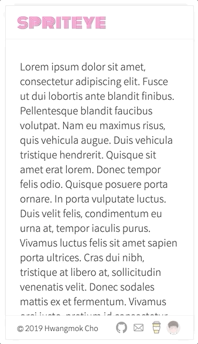

[지난 글](/posts/2019/09/gatsby-layout)에서 Header와 Footer를 가진 Layout을 만들었다. 두 컴포넌트는 항상 고정되어 있다. 하지만 상대적으로 화면이 작은 모바일에서 글을 읽을 때(스크롤을 내릴  때)는 두 Marginal 컴포넌트가 사라지도록 기능을 추가한다.

특정 조건을 만족할 때 컴포넌트의 클래스 이름을 쉽게 변경할 수 있도록 [`Classnames`](https://github.com/JedWatson/classnames) 패키지를 설치하자.

```bash
> npm i -E classnames
```

React Hook 코드들은 `src/hooks`에 위치할 예정이다.  React Hooks를 위해 import alias를 하나 추가한다.

```js:title=gatsby-config.js
  ...
        alias: {
          '~components': 'src/components',
          '~hooks': 'src/hooks', // highlight-line
          '~styles': 'src/styles'
        },
  ...
```

[React Hook](https://ko.reactjs.org/docs/hooks-intro.html)을 사용해서 스크롤 방향을 알아낼 수 있는 커스텀 혹을 만들어보자. 이 훅은 [`useState`](https://ko.reactjs.org/docs/hooks-state.html)로 현재 화면의 y 좌표와 스크롤 방향이 위로 가고 있는지 여부를 알 수 있는 속성을 저장하고 반환한다. 상태 값은 [`useEffect`](https://ko.reactjs.org/docs/hooks-effect.html)로 스크롤 이벤트를 수신하여 업데이트해준다.

```js:title=src/hooks/useWindowScrollDirection.js
import { useEffect, useState } from 'react'

function useWindowScrollDirection () {
  const [windowScrollDirection, setWindowScrollDirection] = useState({
    y: typeof window === 'object' ? window.pageYOffset : 0,
    isUp: true
  })

  useEffect(() => {
    const handleScroll = () => {
      setWindowScrollDirection(prev => ({
        y: window.pageYOffset,
        isUp: prev.y > window.pageYOffset
      }))
    }

    window.addEventListener('scroll', handleScroll)

    return () => window.removeEventListener('scroll', handleScroll)
  }, [])

  return windowScrollDirection
}

export default useWindowScrollDirection
```

작성한 훅을 사용하여 아래로 스크롤할 때 Header 컴포넌트의 클래스 이름을 변경하여 컴포넌트가 스르륵 사라지게 만든다.

```js:title=src/components/Layout/Header.js
import cx from 'classnames' // highlight-line
import { Link } from 'gatsby'
import React from 'react'
import styled from 'styled-components'

import LayoutMarginalContainer from '~components/Layout/MarginalContainer'
import useWindowScrollDirection from '~hooks/useWindowScrollDirection' // highlight-line

const StyledHeader = styled.header`
  ...
  {/* highlight-start */}
  transition: top 0.4s ease;

  @media (max-width: 500px) {
    &.hide {
      top: -3.5rem;
    }
  }
  {/* highlight-end */}
`
...

{/* highlight-start */}
const Header = () => {
  const { isUp } = useWindowScrollDirection()
  return (
    <StyledHeader className={cx({ 'hide': !isUp })}>
      <LayoutMarginalContainer>
        <StyledTitle to='/'>spriteye</StyledTitle>
      </LayoutMarginalContainer>
    </StyledHeader>
  )
}
{/* highlight-end */}

export default Header
```

Footer 역시 동일한 방식으로 스크롤 시 `bottom`을 감춰준다.

이제 모바일 화면에서 아래로 스크롤하면 두 컴포넌트가 스르륵 사라진다.



다음 글에서는 다크 테마로 전환할 수 있도록 테마 토글 버튼을 추가해보자.
